# GovCon Recompete Radar

[](https://github.com/CJud25/GovConRadar/actions/workflows/ci.yml)
&nbsp;·&nbsp; **85 data-integrity checks · all views boot** &nbsp;·&nbsp; **Scorer v2.0.0** &nbsp;·&nbsp; Python 3.10+ &nbsp;·&nbsp; [Live demo → cjudk25.streamlit.app](https://cjudk25.streamlit.app)

**Find the DoD cyber/IT contracts coming up for recompete — and know which numbers you can defend.**

An ETL + BI pipeline over public **USAspending.gov** and **SAM.gov** data that finds expiring DoD
cybersecurity/IT contracts, estimates their recompete windows, scores each for pursuit fit against
*your* company profile, and ships the result as a Power BI star schema **and** a Streamlit companion app.

> **The product's brand is honesty.** Every number on screen is built to survive scrutiny from someone
> who does capture management for a living. Facts are labeled facts; estimates are labeled estimates;
> and records the data can't stand behind are **quarantined, not dressed up as leads.**

**Explore:** [Query the data model in SQL](#query-the-data-model-in-sql) &nbsp;·&nbsp; [ETL mini-pipeline](pipeline_demo/) &nbsp;·&nbsp; [Screens](#screens) &nbsp;·&nbsp; [Docs](#docs)

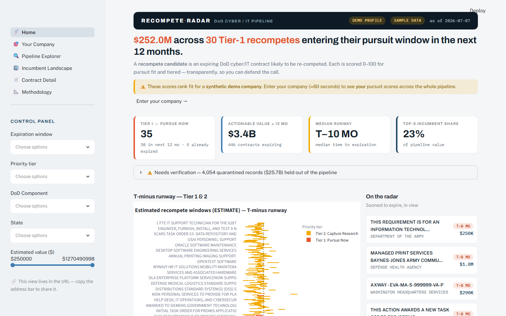

## The honest headline

From the current public snapshot (2026-07-15, spanning **FY2019–FY2026** award history), computed —
never hardcoded — and enforced by `scripts/validate_data.py`:

- **5,712 active recompete candidates (~$49.4B)** across **1,492 contract vehicles**,
- plus **859 recently-expired (≤90 days) grace candidates**, flagged to verify on SAM.gov,
- and **29,393 historical/long-expired records (~$171B) quarantined for verification** — seven years
  of award history that enriches vendor books, price comparables, and tenure signals, but is excluded
  from every headline, chart, and default export, reachable only via the "Needs verification" surfaces.
  (The Data-Gap *tier* holds 29,400 rows: these plus garbled-but-active records.)
- **197 candidates carry FPDS termination evidence** (new in 2.3.0): 80 likely-complete
  terminations had their expiration retargeted to the termination date (`expiration_date_basis
  = "terminated"`) so an ended contract can no longer ride the forward pipeline as a live lead.

> These figures are computed from the **full public snapshot** (~238K awards). The repo ships a
> deterministic **5,000-row sample** (`data/sample/`) so it clones and runs with zero setup; fetch the
> full snapshot with `py scripts/download_data.py` to reproduce the headline numbers locally.

An earlier version reported "4,695 candidates / $64.6B / 118 Tier-1" — but **1,580 of those were
already expired** (the oldest ended in **2003**), because the scorer gave any expired contract maximum
urgency. v2.0.0 fixes that: **Tier 1 went 118 → 37** (recomputed on every rebake), and the average
data-quality score went from a fake **100.0** to an honest **55.1**. See [`CHANGELOG.md`](CHANGELOG.md).

## What makes it credible

- **Graduated expired-record policy** — active / expired-≤90d-grace / expired-stale, with stale
  records forced to a **Data Gap** quarantine tier. Runway is recomputed to *today* on every load.
- **Score-as-your-company** — enter your NAICS/PSC/capabilities/past-performance and watch all ~36,000
  scores and the tier board recompute live; the labeled demo baseline is kept for before/after deltas.
- **Competitive Price Range, not "price-to-win"** — a range of what comparable work has historically
  been *won* for (a fact), which **refuses to estimate** below a comparables floor rather than
  inventing a number. Competitor bids are never public, and the tool says so.
- **Contract-vehicle rollup** — up to 1,211 identical-looking task orders under one IDV collapse to a
  single vehicle row you can actually pursue.
- **Auditable by construction** — `scripts/validate_data.py` re-derives every KPI from the fact tables
  and proves the app's live re-score reproduces the baked data (max diff 0.0). It runs in CI.

## How we compare

Three design principles, stated about market *patterns* rather than named products:

| The common pattern | What ships here instead |
|---|---|
| A single black-box opportunity score | Eight decomposed components in `fact_scoring_breakdown`, reason chips with named bases, and a public source link on every row |
| A price estimate for every record, no matter how thin the data | A comparables **floor that refuses** (`ptw_basis="insufficient"`) — and the same coverage gates on every mod/termination signal |
| Missing data quietly filled with a plausible middle | **Unknown as a first-class answer**: renormalized weights, a visible Data-Gap quarantine tier, and validator-enforced "an Unknown can never carry a number" invariants |

All three are enforced by `scripts/validate_data.py` on every published bundle — testable claims,
not marketing (see `docs/methodology_notes.md` → *How we compare*).

## Quickstart

```bash
# Windows: use the py launcher (the Store 'python' is a broken stub)
py -m pip install -r requirements-dev.txt

# Run the app. On a fresh clone it boots on the committed data/sample/ subsample —
# no pipeline, data download, or API key needed.
py -m streamlit run streamlit_app/app.py

# Optional: pull the FULL snapshot for local full-data dev (not committed; ~44 MB)
py scripts/download_data.py            # -> data/powerbi/  (then the app reads "live")

# Verify the shipped bundle — the exact gates CI runs on every push
py scripts/validate_data.py --sample   # 85 data-integrity checks over data/sample/
py scripts/smoke_app.py                # boots every app view on the sample

# The full snapshot (if pulled above) validates with the same contract
py scripts/validate_data.py            # data/powerbi/  (SKIPs if absent)
```

**Which data the app uses** (`streamlit_app/components/data.py::resolve_data_dir`), in order:
`$RADAR_DATA_DIR` (explicit override) → `data/powerbi/` (the full snapshot, if present locally) →
`data/sample/` (the committed seeded subsample default) → `streamlit_app/assets/sample_data/` (legacy
synthetic bundle). The full snapshot is **not committed** as part of the data diet — fetch it with
`py scripts/download_data.py`; a fresh clone runs on `data/sample/`.

The full ETL pipeline (`py run_pipeline.py`, in the private source repo — not shipped here) needs local
bulk CSV exports; the app and validators run without it against the shipped star schema.

## Query the data model in SQL

The same star schema the app and Power BI read is queryable directly with **DuckDB** — no database
to stand up. `run_sql.py` registers every table (Parquet-preferred, CSV fallback) as a view over the
resolved data dir (the same `$RADAR_DATA_DIR → data/powerbi/ → data/sample/` order the app uses), so
on a fresh clone it runs against the committed `data/sample/` subsample out of the box:

```bash
py run_sql.py sql/01_recompete_expiring_next_12mo_by_naics.sql          # pretty table
py run_sql.py sql/04_competitive_price_range_by_psc.sql --csv           # CSV to stdout
```

The [`sql/`](sql/) pack is six analyst queries, each headed by its business question, the tables it
touches, and a **FACTS vs ESTIMATES** caveat. Collectively they exercise CTEs, fact↔dimension joins,
`RANK`/`LAG` window functions, and `GROUP BY … HAVING`:

| File | Business question | Technique |
|---|---|---|
| `01_recompete_expiring_next_12mo_by_naics.sql` | Recompete pipeline expiring in the next 12 months, by NAICS | CTE · join · GROUP BY |
| `02_incumbent_concentration_by_dod_component.sql` | Top-incumbent share of each **DoD Component**'s pipeline | `RANK`/`SUM` window |
| `03_pursuit_score_distribution_by_tier.sql` | Pursuit-score spread across priority tiers | join · GROUP BY |
| `04_competitive_price_range_by_psc.sql` | **Competitive Price Range** — historical comparable *won* ranges by PSC | GROUP BY · `HAVING` (min-sample) |
| `05_yoy_obligation_trend.sql` | Year-over-year obligation trend | `LAG` window |
| `06_pipeline_mix_by_fiscal_quarter.sql` | Expiring-vs-active pipeline mix by fiscal quarter | join · running-total window |

> Query 04 is a **Competitive Price Range, not a price-to-win** — every dollar is an actual obligated
> (won) amount on a historically comparable award, and the `HAVING` clause **refuses** to publish a
> range below a minimum comparable count rather than inventing a number. Competitor bids are never
> public; the query never predicts one.

Example — the full text of query 01 and its **actual output on the committed `data/sample/` subsample**
(a seeded 5,000-candidate slice; the full snapshot returns far larger counts):

```sql
-- sql/01_recompete_expiring_next_12mo_by_naics.sql
WITH expiring_soon AS (
    SELECT
        CAST(naics AS VARCHAR)      AS naics_code,
        candidate_id,
        total_obligated_amount
    FROM fact_recompete_candidates
    WHERE candidate_status = 'active'
      AND days_until_expiration BETWEEN 0 AND 365
)
SELECT
    e.naics_code,
    n.naics_description,
    COUNT(*)                                        AS candidates_next_12mo,
    ROUND(SUM(e.total_obligated_amount) / 1e6, 2)   AS pipeline_obligated_musd
FROM expiring_soon e
LEFT JOIN dim_naics n
       ON CAST(n.naics_code AS VARCHAR) = e.naics_code
GROUP BY e.naics_code, n.naics_description
ORDER BY candidates_next_12mo DESC, pipeline_obligated_musd DESC;
```

```text
$ RADAR_DATA_DIR=data/sample py run_sql.py sql/01_recompete_expiring_next_12mo_by_naics.sql
[run_sql] 01_recompete_expiring_next_12mo_by_naics.sql  |  data=.../data/sample  (mode=custom)  |  16 tables registered
┌────────────┬────────────────────────────────────────────────────────────────────────────────────────┬──────────────────────┬─────────────────────────┐
│ naics_code │                                   naics_description                                    │ candidates_next_12mo │ pipeline_obligated_musd │
│  varchar   │                                        varchar                                         │        int64         │         double          │
├────────────┼────────────────────────────────────────────────────────────────────────────────────────┼──────────────────────┼─────────────────────────┤
│ 541519     │ Other Computer Related Services                                                        │                  174 │                 1035.82 │
│ 541512     │ Computer Systems Design Services                                                       │                  115 │                 1037.95 │
│ 541511     │ Custom Computer Programming Services                                                   │                   57 │                   510.8 │
│ 518210     │ Computing Infrastructure Providers, Data Processing, Web Hosting, and Related Services │                   21 │                   93.92 │
│ 541330     │ Engineering Services                                                                   │                   18 │                  361.05 │
│ 541513     │ Computer Facilities Management Services                                                │                   14 │                  166.59 │
│ 541611     │ Administrative Management and General Management Consulting Services                   │                    4 │                   33.39 │
└────────────┴────────────────────────────────────────────────────────────────────────────────────────┴──────────────────────┴─────────────────────────┘
```

`naics_description` comes from the `dim_naics` join; `pipeline_obligated_musd` is a **fact** (FPDS
obligation), while the 12-month expiry window is an **estimate** recomputed to today (only
`candidate_status = 'active'` rows count — expired-grace/-stale records are held out for verification).

## What's new — honesty-first reads (2026-07)

Each addition **refuses to guess** where the public data won't support a claim — the whole brand, made visible.

**2.3.0 — "keep the mods"**: the pipeline now keeps each award's **modification history** instead of collapsing it away. Terminated contracts stop ghost-riding the forward pipeline (**Terminated (verify)** badge, `expiration_date_basis="terminated"`); new coverage-gated signals — mod velocity, ceiling-balloon, deobligation, bridge-extension, **successor-visible** (the recently-lapsed "bridge watch" lens), and an incumbent **size-determination shift** flag — each with a named basis and an unforgeable Unknown; plus a populated `fact_transactions` evidence table and a Sources Sought early-warning lane. Every mods-derived surface carries the disclosure: *"DoD FPDS reporting lags ~90 days; termination signals are ≥3 months old."*

| | |
|---|---|
| 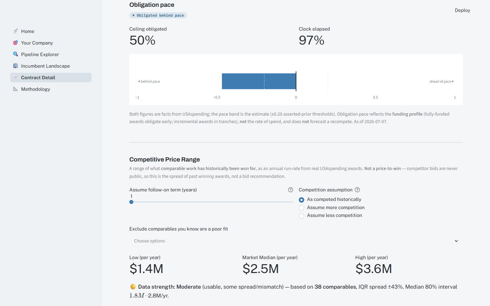 | 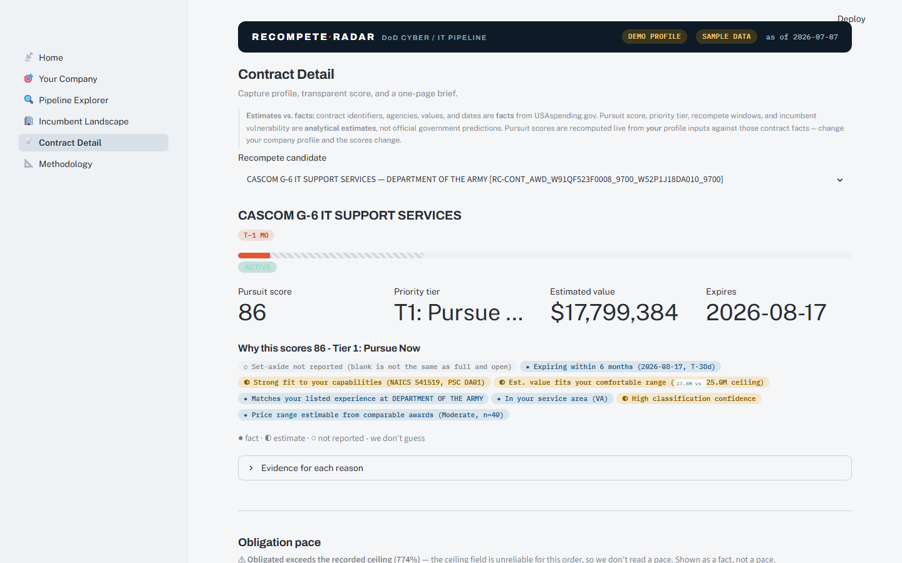 |
| **Obligation pace** — how much of a contract's ceiling has been obligated ("Ceiling obligated") vs. how much of its period of performance has elapsed ("Clock elapsed"). A *descriptive* read that reflects the **funding profile** — **not** spend, and **not** a recompete forecast; on most orders it says "not measurable" rather than guess. | **Reason codes** — the 8-component score as a chip row stamped **● fact · ◐ estimate · ○ not reported**. A blank set-aside shows "○ not reported (blank is not the same as full and open)" instead of pretending it's full-and-open — the refusal made visible. |
| 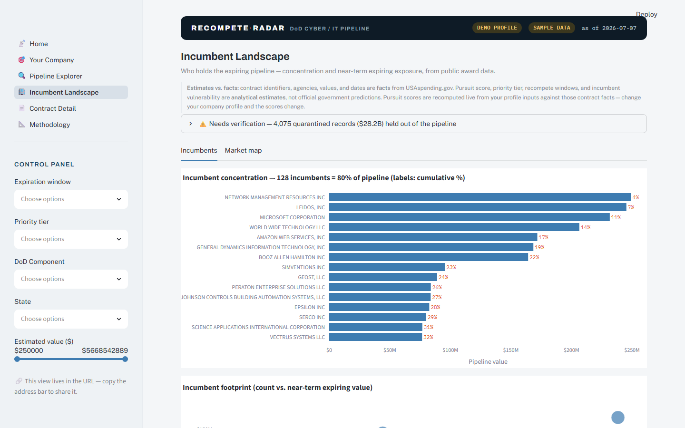 | 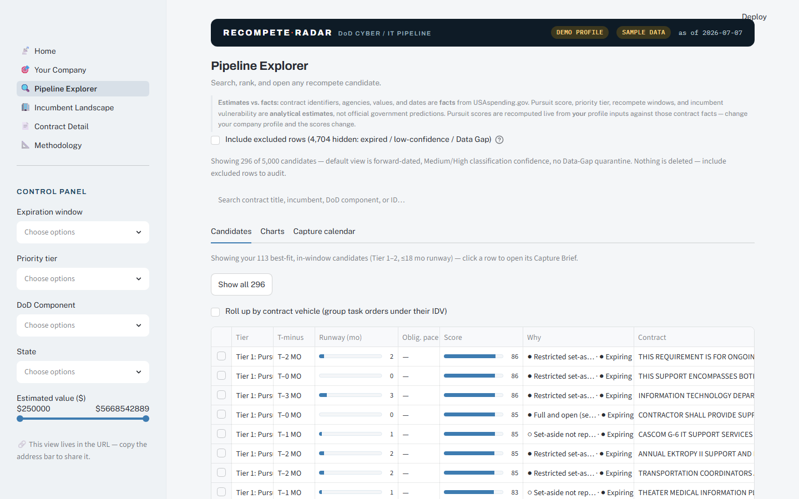 |
| **Incumbent concentration** — the top incumbent's share of expiring obligated dollars per DoD component; markets too thin to read show as **"Unknown."** A descriptive read of this pipeline slice — **not** market share, market power, or contestability. | **Pipeline Explorer** now carries **Oblig. pace** and **Why** columns; the pace reads "—" wherever an order can't be honestly paced (most of them). |

## Screens

| | |
|---|---|
| 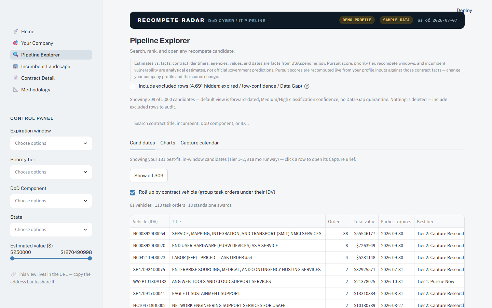 | 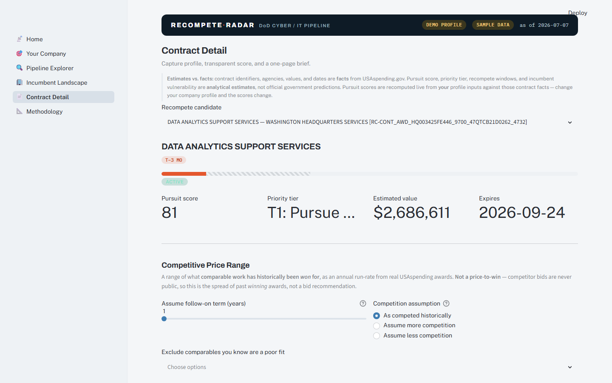 |
| Explorer: the trusted default view (excluded rows disclosed, one click from auditable) with the contract-vehicle rollup on | Contract Detail: the price range refusing to guess |
| 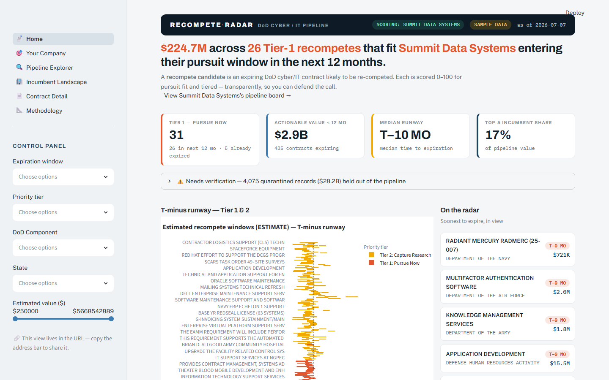 | 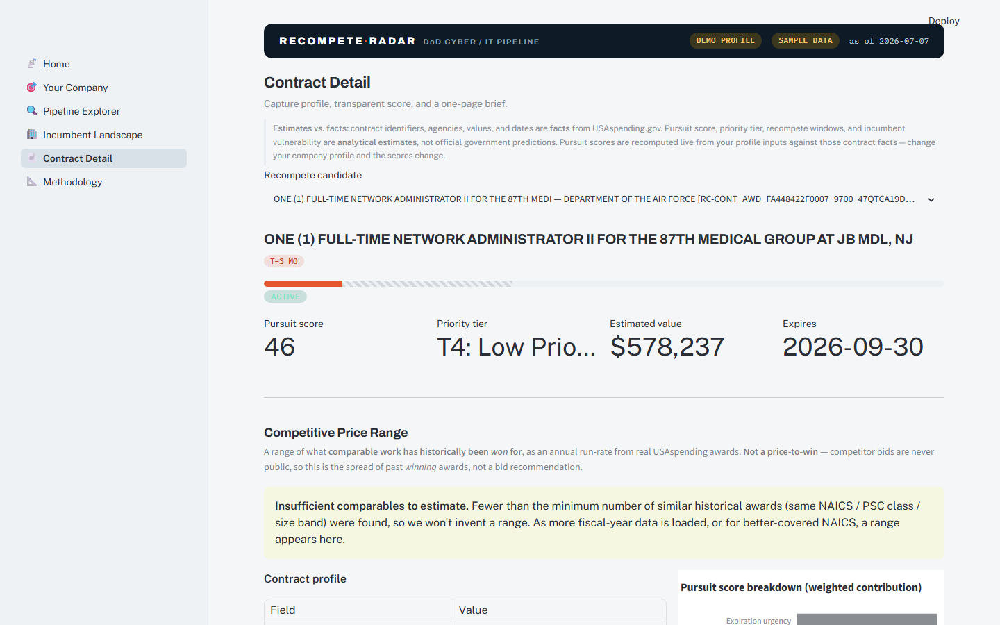 |
| Score-as-your-company: the board re-scored live for a custom profile (Tier-1 35 → 31) | The refusal state: below the comparables floor the range says so |
| 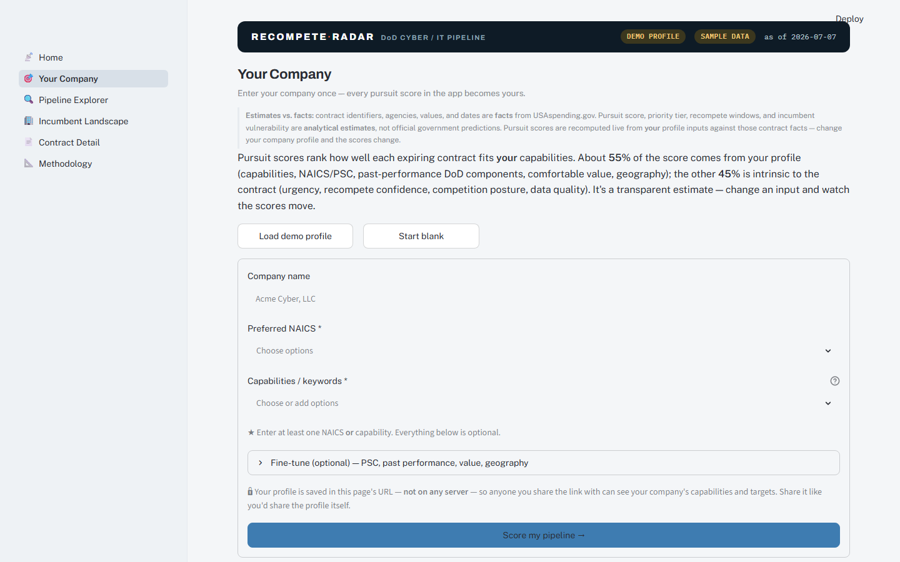 | 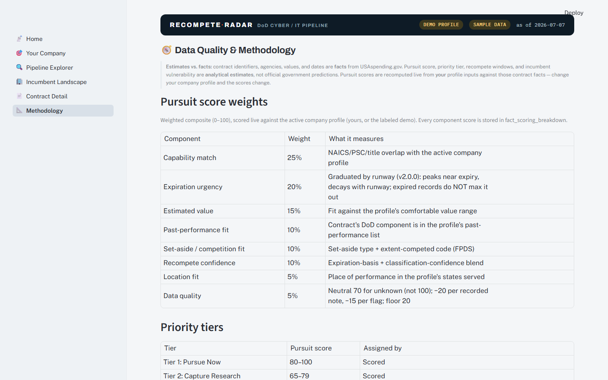 |
| The 60-second profile form (profile lives in the URL, never on a server) | Methodology: weights, tiers, and honesty rules on one page |

_(Screenshots are generated per [`docs/screenshots/SCREENSHOTS_TODO.md`](docs/screenshots/SCREENSHOTS_TODO.md) —
each has a deep-link URL, target filename, and viewport, so dropping the PNGs in completes the gallery.)_

## Docs

- [Architecture](docs/ARCHITECTURE.md) — data flow from USAspending/SAM.gov → star schema → {Power BI, Streamlit}
- [Standard Operating Procedure (v2.1)](docs/SOP_Recompete_Radar_v2.1.md) — controlled refresh/validate/deploy runbook (supersedes the earlier informal SOP)
- [Data dictionary](docs/DATA_DICTIONARY.md) — every table/column, with the v2 additions and legacy notes
- [Data provenance](docs/DATA_PROVENANCE.md) — where the numbers come from; sample-data synthesis
- [Demo script](docs/DEMO_SCRIPT.md) — a 5-minute buyer walkthrough with the three "aha" beats
- [Changelog](CHANGELOG.md) · [Methodology](docs/methodology_notes.md) · in-app Methodology page

## Validation

The integrity contract is code, not prose:

```bash
py scripts/validate_data.py && py scripts/validate_data.py --sample
```

It fails loudly on any of: scorer non-parity, a stale record in Tiers 1–4, an expired row in a forward
bucket, a KPI that doesn't tie to the facts, an unflagged garbled title, a `title_display` that leaks a
raw record, a schema violation, or a snapshot/version mismatch.

**What this validator proves — and what it can't.** `validate_data.py` proves the published
bundle is *internally honest*: every KPI re-derives from the shipped fact tables, the app's live
re-score reproduces the baked scores exactly (max diff 0.0), quarantine and Unknown rules hold,
and no excluded column or personnel-marked title ships. It does **not** prove that the pipeline
captured every relevant DoD contract (extraction completeness), that USAspending/FPDS records are
themselves correct or current (source accuracy — DoD FPDS reporting lags ~90 days), or that
estimates like recompete windows and pursuit scores are predictively accurate (the Methodology
page states what each estimate is based on). It checks the copy you have, not the world it
describes.

## Scope

This repo is the analytics product: a static, periodically-refreshed public-data snapshot deployable to
Streamlit Community Cloud (no auth, no database, no runtime API calls). Accounts, alerts, and scheduled
refresh belong to a separate private SaaS and are out of scope here.
