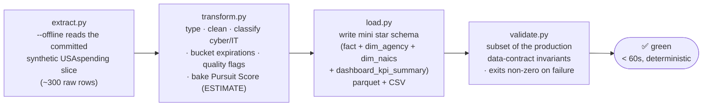

# pipeline_demo — sanitized ETL mini-pipeline

A tiny, deterministic, **network-free** reproduction of the production ETL, built to
be read end-to-end in one sitting. It mirrors the real pattern —
**extract → transform → load → validate** — at a scale you can hold in your head.

> The production pipeline processes ~26K awards (`fact_contract_awards` = 26,041 rows);
> this demo reproduces the same extract → transform → load → validate pattern on a
> ~300-row slice.

> **⚠️ All input data is 100% SYNTHETIC.** The committed fixture
> (`fixtures/usaspending_dod_fy2024_synthetic.json`) is deterministically fabricated by
> `extract.py --generate-fixture`. **No value represents any real federal award, vendor,
> agency, or person.** Every pursuit score and expiration window below is an **ESTIMATE**
> for demonstration only — never an official government prediction, bid, or certification.

## Flow



## Run it

```bash
py pipeline_demo/run_all.py --offline      # deterministic, network-free (demo/CI mode)

# individual stages (each is independently runnable):
py pipeline_demo/extract.py   --offline
py pipeline_demo/transform.py --offline
py pipeline_demo/load.py
py pipeline_demo/validate.py

# maintenance / opt-in:
py pipeline_demo/extract.py --generate-fixture   # re-derive the committed fixture
py pipeline_demo/run_all.py --online             # best-effort LIVE USAspending pull (NOT used by CI)
```

`--offline` is the default everywhere. The live USAspending search API is
known-unreliable (intermittent HTTP 503s under load — see
`src/api_clients/usaspending_bulk.py`), so the demo and CI never touch the network:
they read the committed synthetic fixture and are fully reproducible.

## What each stage mirrors

| Demo stage | Mirrors in production | What it does (kept deliberately small) |
|---|---|---|
| `extract.py` | `src/extract/awards.py`, `src/api_clients/usaspending_bulk.py` | One agency (DoD, 097) + one fiscal year (2024) at a small page size. `--offline` reads the committed synthetic fixture. |
| `transform.py` | `src/transform/{classification,recompete}.py`, `src/scoring/{quality_flags,pursuit_score}.py` | Typing/cleaning, a **simplified** cyber/IT multi-signal classification, expiration bucketing, quality flags, and the 8-component weighted Pursuit Score (v2.0.0) with the Data-Gap quarantine override. |
| `load.py` | `src/export/powerbi_export.py`, `scripts/rebake_data.py` | Splits the modeled fact into a **mini star schema** and writes parquet **and** CSV. |
| `validate.py` | `scripts/validate_data.py` | Runs a **subset** of the production data-contract invariants against the mini output; **exits non-zero** on any failure. |

The transform quality/scoring functions are faithful, byte-behaviour mirrors of the
production primitives (kept self-contained so the demo has no `src/` or `config/`
dependency). `validate.py` re-imports `transform.score_frame` and asserts the re-score
reproduces the baked score exactly — the same "is this data honest?" contract the
production validator enforces.

## Mini star schema (`output/star/`)

- **`fact_recompete_candidates`** — grain: one recompete candidate (FK → `dim_agency`, `dim_naics`).
- **`dim_agency`** — DoD component (agency + subagency) rollup.
- **`dim_naics`** — NAICS-code rollup.
- **`dashboard_kpi_summary`** — one row of headline KPIs, every value re-derived from the fact table (never hand-set).

Output is **git-ignored** and regenerated on every run (the repo follows a data-DIET,
don't-commit-generated-artifacts convention); the only committed input is the synthetic
fixture.

## Invariants checked (subset of the production 7)

1. **Scorer parity** — re-score reproduces the baked `pursuit_score` (max abs diff 0.0) and `priority_tier` (100% match).
2. **Quarantine** — no `expired_stale` / `days < -90` row in Tiers 1–4.
3. **Bucket integrity** — known-bucket partition; no expired row in a forward bucket; bucket ↔ days & `bucket_sort` consistency; days recomputable from `selected_expiration_date` vs snapshot.
4. **KPI re-derivable** — headline KPIs recompute from the fact table (± $1 on money).
5. **Quality** — garbled-title flags recompute; `title_display` never garbled and never leaks an `IGF::` code.
6. **Schema contract** — required columns present per table.
7. **Snapshot / version / format** — `snapshot_date` parseable; `scorer_version` matches; CSV and Parquet agree where both ship.

## Illustrative output (deterministic synthetic-fixture run)

These are the **real, reproducible** numbers this pipeline emits from the committed
synthetic fixture — **illustrative only** (synthetic data; not real awards):

- 300 raw rows → **189** recompete candidates (cyber/IT-relevant and ≥ $250K obligated)
- **4** Tier 1 ("Pursue Now"), **57** quarantined to "Data Gap"
- **53** `expired_stale`, **13** `expired_grace`, **123** active
- `dim_agency` = 6 rows, `dim_naics` = 8 rows, `dashboard_kpi_summary` = 1 row
- 29/29 invariants **PASS**; end-to-end in **~0.3s** (budget: 60s)

Snapshot date is fixed at `2024-10-01` (a demo must be byte-reproducible; production
uses `date.today()`).
